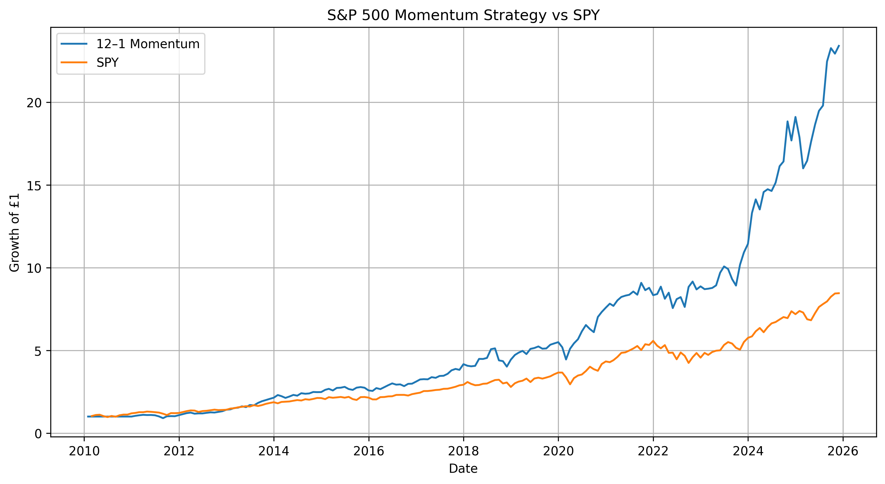
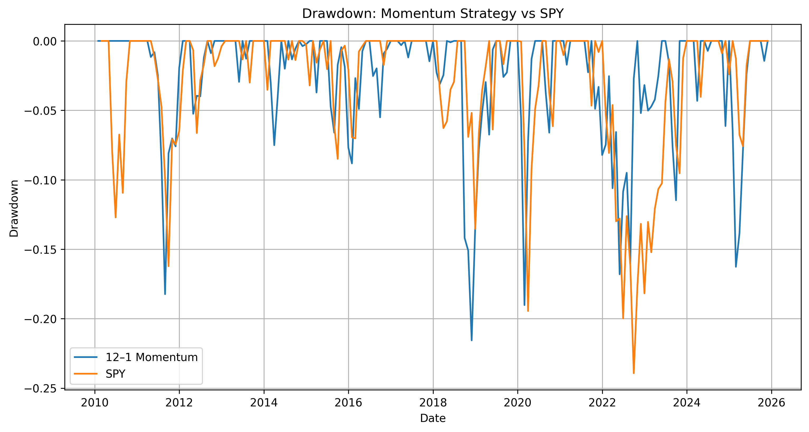

# S&P 500 Momentum Strategy

A systematic momentum strategy applied to S&P 500 equities, implemented and backtested in Python.

The project attempts to investigate whether stocks with a strong recent performance tend to outperform the broader market over subsequent months.

Before starting, I want to state that the inspiration for this project was because it has always intrigued me, as a long-term investor, how momentum could affect the stock even though the underlying fundamental remains the same. So, I decided to investigate it further. Also, I would like to give a shoutout to ChatGPT and Claude for doing the heavy lifting on the coding side for me (I really need to get my Python skill up).

---

## Overview

This project implements a monthly-rebalanced, long-only momentum strategy based on the classic **12–1 momentum signal** .

At the end of each month:

1. Calculate each stock's return over the previous 12 months.
2. Exclude the most recent month to reduce short-term reversal effects.
3. Rank stocks by their momentum score.
4. Select the top 10% of stocks.
5. Allocate equal weights across the selected stocks.
6. Hold the portfolio for the following month.
7. Repeat the process monthly.

The strategy is evaluated against **SPY** as a benchmark.

---

## Results

### Baseline Strategy vs SPY

| Metric | Momentum | SPY |
|---|---:|---:|
| CAGR | **22.04%** | 14.44% |
| Annualized Volatility | 17.93% | 14.36% |
| Sharpe Ratio | **1.20** | 1.02 |
| Maximum Drawdown | **−21.56%** | −23.93% |

The baseline momentum strategy produced a higher CAGR and Sharpe ratio than SPY over the backtest period, while also experiencing a slightly smaller maximum drawdown.

The higher return came with higher volatility, highlighting the importance of evaluating risk-adjusted performance rather than returns alone.

---

## Equity Curve



The chart shows the growth of £1 invested in the momentum strategy compared with SPY.

---

## Drawdown Analysis



The strategy's maximum drawdown was approximately **−21.56%**, occurring during 2018.

The 2018 drawdown was interesting because momentum stocks experienced a sharp decline, while the broader market didn't. From the August 2018 peak to the November 2018 trough, the momentum portfolio declined approximately **21.56%**, compared with approximately **4.62% for SPY** over the same period.

This shows an important characteristic of momentum strategies: while momentum may hold in long term, an abrupt factor can generate significant short term loss.

---

## Robustness Analysis

The strategy was tested under several alternative specifications.

| Strategy | CAGR | Volatility | Sharpe | Max Drawdown |
|---|---:|---:|---:|---:|
| 6–1 Top 10% | 24.39% | 18.49% | **1.28** | −21.87% |
| 12–1 Top 10% | 22.04% | 17.93% | 1.20 | −21.56% |
| 12–2 Top 10% | 22.94% | 18.11% | 1.23 | −21.09% |
| 12–1 Top 20% | 18.86% | 15.75% | 1.18 | −21.04% |
| SPY | 14.44% | 14.36% | 1.02 | −23.93% |

The positive results across different momentum  and portfolio-concentration specifications suggest that the observed performance is not by pure chance of choosing a lucky parameter.

---

## Transaction Cost Sensitivity

Portfolio turnover was incorporated into a transaction-cost sensitivity analysis.

Average monthly portfolio turnover was approximately **25.95%**.

| Transaction Cost | CAGR | Sharpe |
|---:|---:|---:|
| 0 bps | 22.04% | 1.20 |
| 5 bps | 21.85% | 1.19 |
| 10 bps | 21.66% | 1.18 |
| 20 bps | 21.29% | 1.17 |
| 50 bps | 20.17% | 1.11 |

The strategy remained profitable under relatively high assumed transaction costs.

---

## Methodology

The backtest follows the following pipeline:

```text
S&P 500 Universe
       ↓
Historical Prices
       ↓
Monthly Price Series
       ↓
12–1 Momentum Signal
       ↓
Cross-Sectional Ranking
       ↓
Top 10% Selection
       ↓
Equal-Weight Portfolio
       ↓
Monthly Rebalancing
       ↓
Strategy Returns
       ↓
Performance & Risk Analysis

